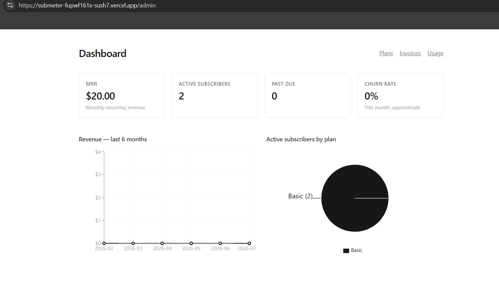
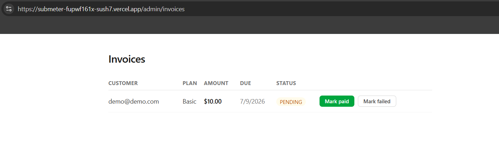
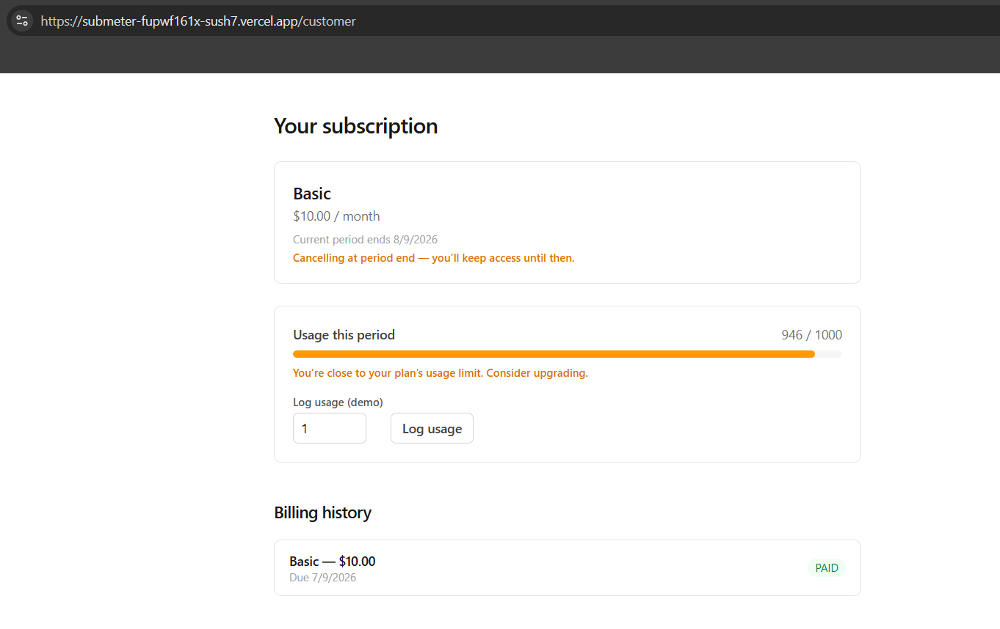

# SubMeter — Case Study

**Live demo:** https://submeter-taupe.vercel.app/
**Repo:** https://github.com/Sushmaa2407/submeter

## Problem

Subscription businesses live or die by numbers most off-the-shelf tools hide behind a paywall: Monthly Recurring Revenue, churn, and whether customers are actually using what they're paying for. A founder running a small SaaS shouldn't need a $50/month billing platform just to see those three numbers clearly.

SubMeter is a self-hosted subscription billing platform that handles the full loop — plans, subscriptions, recurring invoicing, usage limits, and the analytics dashboard that ties it together — built to prove I can own a real product end to end, not just wire up a CRUD form.

## Approach

**Spec before code.** Every feature started as a written plan — user stories, a locked data model, and explicit assumptions — before a single line of implementation. Four early decisions shaped everything downstream: one active subscription per customer at a time, upgrades taking effect at the next cycle (no proration math), usage limits that warn instead of block, and fully simulated payments so the 10-day timebox stayed realistic instead of getting swallowed by a Stripe integration.

**Data model.** Five tables — `User`, `Plan`, `Subscription`, `Invoice`, `UsageRecord` — with one constraint doing a lot of quiet work: a unique index on `(subscriptionId, periodStart)` that makes the billing job **idempotent**. A cron job retrying or double-firing is normal infrastructure behavior, not an edge case to hope never happens, and the database itself — not application logic I could get wrong — is what guarantees no customer is ever double-billed.

**Trade-offs I made deliberately, not by accident:**
- Payments are simulated (an admin manually confirms an invoice was paid) rather than wired to a real gateway — documented as an explicit stretch goal, not hidden as a gap.
- Churn rate is an honest approximation (`active now + cancelled this month`, standing in for "active at month start"), because true churn needs daily historical snapshots that weren't in scope. I chose to label it clearly as approximate in the code and the dashboard rather than present a precise-looking number that wasn't actually precise.
- Email verification is stubbed behind a single function so a real provider is a one-file swap later, not a rewrite — the architecture doesn't block the upgrade, time does.

**A real problem I hit:** middleware in Next.js runs in a restricted Edge runtime that can't execute native code — and my password-hashing library (Argon2, which is actually written in Rust) is exactly that. The fix was splitting the auth configuration into an Edge-safe piece (just enough to read a session) and a full Node-only piece (the actual password verification), so the lightweight route-protection layer never has to load the heavy password-checking machinery it never actually needed.

## Result

-  

- 
- 

**What I'd build next:** a real Stripe integration behind the same `markInvoiceStatus()` function that already exists — the interface was built to make that swap small on purpose. After that, daily usage/subscriber snapshots, which would upgrade the churn number from a documented approximation to an exact figure.

## What I learned

Looking back at this build, a few moments stand out—not because they were smooth, but because they forced me to think differently.

One of the biggest shifts came while debugging across the Edge and Node runtimes. At first, it felt like something was “randomly breaking,” but it wasn’t random at all—it was me not fully understanding the execution boundaries. Code that worked perfectly in one environment would fail silently or behave differently in another. That experience pushed me to stop treating the framework as a black box and actually understand where my code was running and why. It made debugging feel less like guessing and more like reasoning.

Another moment that changed how I think was implementing database constraints, especially idempotency. Before this, it was something I had only read about—conceptually useful, but abstract. But during this project, I saw it prevent a real bug: duplicate actions that could have easily slipped through under certain conditions. That was the first time a “theoretical best practice” proved its value in a very real way. It made me appreciate how much thought goes into designing systems that are resilient, not just functional.

There were also multiple points where things could have easily derailed the momentum—a Tailwind major version change that broke styling unexpectedly, hitting a connection pool limit at the worst time, and even small but frustrating issues like misplaced files. None of these were individually huge problems, but together they could have slowed everything down. What mattered was learning to keep moving—fixing what needed to be fixed without losing sight of the actual product I was trying to build.

If there’s one honest takeaway, it’s that progress wasn’t linear. It was a mix of small wins, confusing bugs, and moments where things finally “clicked.” And those moments—where something stops being theory and becomes something you’ve actually experienced—are what made this build worth it.
